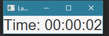

# Lab 10: Multithreading
This lab will cover the following topics:
* Basic Java Multithreading
* Multithreading in JavaFX
* Bindings and properties in JavaFX

## Background
A process can be considered as a program in execution. The process itself can be divided into several threads, each running concurrently with other threads. For instance, a word editor process could have a thread dedicated to running spell checking, and another dedicated to synchronizing with the cloud.

## Creating a thread
There are two common ways of creating a thread: extending the Thread class (not preferred), and passing the thread constructor an object which implements the Runnable interface. We will focus on the second way, using regular class, anonymous class and lambda.

### 1. Creating a regular class that implements Runnable
```
// TaskClass.java
// Custom task class
public class TaskClass implements Runnable {
  ...
  public TaskClass(...) { ... }
  // Implement the run method in Runnable interface
  public void run() {
    ...
  }
}

// Client.java
public class Client {
  ...
  public void someMethod() {
    ...
	// Create an instance of TaskClass
	TaskClass task = new TaskClass(...);
	
	// Create a thread
	Thread thread = new Thread(task);
	
	// Start a thread
	thread.start();
	...
  }
  ...
}
```

### 2. Anonymous class
```
// Client.java
public class Client {
  ...
  public void someMethod() {
    ...
    // Create an instance of TaskClass
    TaskClass task = new TaskClass(...);
	
    // Create a thread
    Thread thread = new Thread(new Runnable() {
      // Implement the run method in Runnable interface
      public void run() {
        ...
      }
    });
	
    // Start a thread
    thread.start();
    ...
  }
  ...
}
```

### 3. Lambda expression
```
// Client.java
public class Client {
  ...
  public void someMethod() {
    ...
    // Create an instance of TaskClass
    TaskClass task = new TaskClass(...);
	
    // Create a thread
    Thread thread = new Thread(() -> {      
      ...
    });
	
    // Start a thread
    thread.start();
    ...
  }
  ...
}
```

Just like in lab 9, we prefer using lambda expressions because it requires less typing and is easier to read.

## Complete example
```
// TaskThreadDemo.java

// The task for printing a specified character in specified times
class PrintChar implements Runnable {
  private char charToPrint; // The character to print
  private int times;        // The times to repeat
  
  /** Construct a task with specified character and number of
   *  times to print the character
   */
  public PrintChar(char c, int t) {
    charToPrint = c;
    times = t;
  }
  @Override
  /** Override the run() method to tell the system
   * what the task to perform
   */
  public void run() {
    for (int i = 0; i < times; i++)
      System.out.print(charToPrint);
  }
}

// The task class for printing number from 1 to n for a given n
class PrintNum implements Runnable {
  private int lastNum;
  /** Construct a task for printing 1, 2, ... i */
  public PrintNum(int n) {
    lastNum = n;
  }
  @Override
  /** Tell the thread how to run */
  public void run() {
    for (int i = 1; i <= lastNum; i++) {
      System.out.print(" " + i);
    }
  }
}

public class TaskThreadDemo {
  public static void main(String[] args) {
    // Create tasks
    Runnable printA = new PrintChar(a, 10);
    Runnable printB = new PrintChar(b, 10);
    Runnable print10 = new PrintNum(10);
    // Create threads
    Thread thread1 = new Thread(printA);
    Thread thread2 = new Thread(printB);
    Thread thread3 = new Thread(print10);
    // Start threads
    thread1.start();
    thread2.start();
    thread3.start();
  }
}
```

If we execute the program 4 times, we might get:
```
aaaaaaaaaa 1 2bbbbbbbbbb 3 4 5 6 7 8 9 10
aaaaaaaaaa 1bbb 2bbbbbbb 3 4 5 6 7 8 9 10
aaaaaaaaaa 1b 2bbbbbbbbb 3 4 5 6 7 8 9 10
aaaaaaaaaa 1b 2 3 4 5bbbbbbbbb 6 7 8 9 10
```
The outputs are different because it's up to the scheduler to decide which thread runs when! In order to implement more granular controls, we will need to do it ourselves using locks and semaphores (not covered in this lab). 

### Useful methods in the Thread class
* Thread(Runnable task): constructor
* void start(): start the thread, invoking the Runnable's run()
* boolean isAlive(): if the thread is currently running
* void setPriority(int p): set priority of thread (1 to 10)
* void join(): wait for this thread to finish
* void sleep(long milliseconds): put the thread to sleep for the specified time
* void yield(): cause a thread to pause temporarily, allowing other threads to execute
* void interrupt(): interrupt the thread


## Multithreading in JavaFX
In GUI application, a good practice is using multithreading: one JavaFX Application thread to respond user I/O and processce the GUI event, and other backgound threads to do the computations, like spell checking in word processing application. Otherwsie, the GUI may be frozen when thread is doing background computation.
If a method in non-JavaFX Application Thread wants to modify the UI, it should use `Platform.runLater(Runnable runnable)`, instead of directly calling the related GUI API. `Platform.runLater(Runnable runnable)` will run the specified Runnable on the JavaFX Application Thread at some unspecified time in the future. This method, which may be called from any thread, will post the Runnable to an event queue and then return immediately to the caller. [Official documentation](https://docs.oracle.com/javase/10/docs/api/javafx/application/Platform.html).

This is the case for our lab and PA2, where we use Platform.runLater to update a timer for keeping track of how long the player has been playing.

## Timer logic and Bindings
The Label responsible for displaying the time also uses JavaFX's binding logic to handle new values. Although this code is provided for you for this lab, you may want to study in detail as you will be doing something similar on your own for PA2. Read more about properties and bindings [here](https://docs.oracle.com/javafx/2/binding/jfxpub-binding.htm).

### Timer class
The timer class allows us to schedule tasks for future execution as a fixed interval. For the purposes of this lab, we will only be using the function `scheduleAtFixedRate`, which accepts a TimerTask object that override the `run()` method. It is inside this method that we will perform any updates to the UI via `Platform.runLater`.
Read more [here](https://docs.oracle.com/javase/10/docs/api/java/util/Timer.html). 


## What you need to do
You will create a simple application which simply displays how many seconds it has existed since launch. Clicking on the timer restarts it from 0. This is similar to the timer component used in PA2. The detailed TODOs are provided in the Javadoc comments.  


##Submission:
Zip your code and submit it to CASS