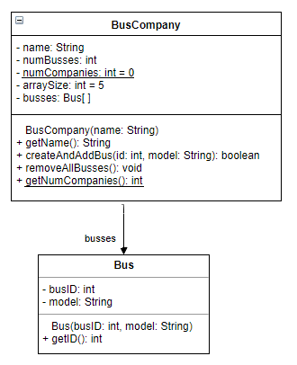

# Lab 2: Classes, Objects, Wrappers, Static  
This lab will familiarize you with the following topics:

* Classes and objects
* Wrapper classes
* Static methods and variables
* Instance and static initializer blocks
* JUnit features

## Classes and Objects
The meaning of class and object has not changed from C++ since COMP2012. This lab will help you get used to working with classes and objects in Java.

## Static methods and variables
The meaning of static has not changed from C++ since COMP2012. Static methods and variables belong to the class, not a specific object. They can be called via the class name. All instances of the class share the same static variables.

## Wrapper classes
Java provides certain wrapper classes which "wrap" primitive types. For example, the Integer class wraps the `int` datatype. This is useful when you use classes in the `java.util` package (e.g. ArrayList), which can only handle objects, not primitive types. The conversions between the primitive and wrapper class are known as autoboxing and unboxing. It is done automatically by Java.

```java
int a = 10;
Integer aa = new Integer(10); //manually using the wrapper class  

int b = aa; //Java does unboxing (from wrapper to primitive)
aa = 20; //Java does autoboxing (from primitive to wrapper)
```

See the lecture notes for more wrapper classes and the methods each provide. Note that these wrapper classes for primitive types are immutable, just like strings.

## Initialization blocks
By now, you've seen two ways of initializing variables:

* Field initializer 

```java
class Person {
    String name = "John";  
}
```

* Constructor

```java
class Person {
    String name;
    Person() { name = "John"; }
}
```

However, it is also possible to initialize variables (both instance and static) using initialization blocks.
### Instance initialization blocks (IIB)
An instance initialization is executed in the following relative order:

1. All data fields initialized to default values (0, false, or null)
2. Field initializers and IIBs executed according to order of appearance
3. Body of constructor executed after body of parent constructor

```java
class Person {
    int age = 10;
    { age = 11; } //IIB
    Student() { age = 18; }
}
// age was 10, then 11, then finally 18
```

### Static initialization blocks (SIB)
Static initialization blocks are only run once, unlike IIBs, which are run each time an object is instantiated. SIBs are run when the class is initialized by the JVM.
 An SIB is executed in the following relative order:
 
 1. All static data fields initialized to default values (0, false, or null)
 2. Static field initializers and SIBs executed according to order of appearance

### When there are subclasses
Even though inheritance will be covered in later labs, the following information is provided for your reference when you look back on the labs in the future. You don't need to know this now. The relative order of IIBs and SIBs is as follows:

* Class initialization (only once)
    * Every static data field initialized to default value (0, false, or null)
    * Parent class' static field initializers/SIBs evaluated in order of appearance
    * Child class' static field initializers/SIBs evaluated in order of appearance
* Child object instantiation (0 or more times)
    * Parent class' instance field initializers/IIBs evaluated in order of appearance
    * Parent constructor
    * Child class' instance field initializers/IIBs evaluated in order of appearance
    * Child constructor

This [example modified from stackoverflow](https://stackoverflow.com/questions/21504726/static-block-vs-initializer-block-vs-constructor-in-inheritance) demonstrates the order.


```java
public class Parent {
    static { System.out.println("i am Parent 3"); }
    { System.out.println("i am parent 2"); }
    public Parent() { System.out.println("i am parent 1"); }
}

public class Son extends Parent {
    static { System.out.println("i am son 3"); }
    { System.out.println("i am son 2"); }
    public Son() { System.out.println("i am son 1"); }

 public static void main(String[] args) {

        System.out.println("Class init by JVM\n");
        System.out.println("Noticed that there is no output when call \"Son son;\"");
        Son son;
        System.out.println("\nThis 1st obj instantiation");
        new Son();
        System.out.println("\nThis 2nd obj instantiation");
        new Son(); 
    }
}
```


```
i am Parent 3
i am son 3
Class init by JVM

Noticed that there is no output when call "Son son;"

This 1st obj instantiation
i am parent 2
i am parent 1
i am son 2
i am son 1

This 2nd obj instantiation
i am parent 2
i am parent 1
i am son 2
i am son 1
```

## JUnit 5
### Introduction
JUnit is a popular unit-testing framework in the Java environment. Functions are annotated with `@Test`, and can be run after code changes to verify the correctness of features. We will be using a few basic features of JUnit in this lab, the `@Test` annotation and several assertion methods. Check out the official Junit 5 documentation for a quick overview. 

Test cases are provided for you.

### JUnit features
You will learn several common JUnit annotations:

* `@Test` annotated functions are run as a separate test. 
* `@BeforeAll` annotated functions are run only once, before any of the `@Test` method in the class are run. Typically, it's used to run a method that performs initialization.
* `@BeforeEach` annotated functions are run before each `@Test` method. Typically used to reinitialize some class attribute used by the method for testing.
* `@AfterAll` typically used for doing cleanup.
* `@AfterEach` typically used to undo some modification, e.g. a database change.  

You will see some of these features in the provided tests.  Note that `@BeforeAll` and `@AfterAll` should be used with static methods. Within each test functions, you will usually see one or more assertions. Most commonly: `assertEquals`, `assertTrue`, `assertFalse`. For a complete list, see the links at the bottom of the page. 

## What you need to do
Do not just open the project in Intellij. You need to *import* it (from existing sources)!  

Implement the following two classes in the following diagram. Use the exact same variable and method names.  
  
For your reference:

* `-` indicates private
* `+` indicates public
* Underline indicates static
* All caps indicates final


A Bus Company can have between 0 to 5 busses. You can use a Java array of size `arraySize` to represent this relationship. Set `arraySize` as 5 and initialize the array `busses` with this size.  

We impose the restriction that each Bus object must have a unique bus ID (unique within its bus company). Before creating a Bus object in the `createAndAddBus` method, check to see if there's already a Bus object with the same ID in the company's bus list. If so, return `false`. Don't construct the bus. Otherwise, construct it according to the provided `id` and `model`, and insert it into the array. However, if the array is full, return `false`.  The `removeAllBusses` function simply resets the company to its original state, with no busses.  

After implementing the two classes, test your code with the provided JUnit test cases, by right clicking the project and clicking `run all tests`. 

## Lab Outcome & Submission

1. Import the project in Intellij.
2. Implement the classes as specified by the uml and make sure your implementation can pass the provided test cases.
3. **Demo to the TAs in lab your implementation and passed tests or submit your project to [CASS](https://course.cse.ust.hk/cass/) before deadline after lab**

## Useful links
* [JUnit assertions](https://junit.org/junit5/docs/5.0.1/api/org/junit/jupiter/api/Assertions.html)
* [Wrapper classes](https://stackoverflow.com/questions/20697868/why-we-need-wrapper-class)