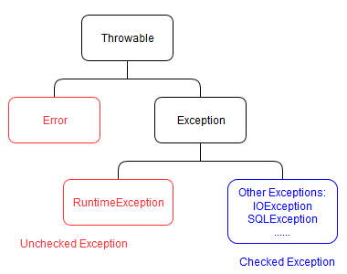

# Lab 5: Exceptions, File IO
This lab will cover the following topics:

* Exceptions
* File IO
* Try with resources
* Local variable inference
* JUnit features relating to exceptions

## Exceptions
Exceptions are used to catch and handle errors in Java. There are two types of exceptions:

* Checked Exception: exceptions that are analyzed by the compiler; must be either caught using a catch block or declared using a throws clause (Otherwise: compilation error)
* Unchecked Exception: not checked by the compiler; usually reflect logic errors that should be corrected in the program (Unchecked exceptions are all subclass of RuntimeException) 



In this lab (and in PA1), we will define our own exception to be thrown when the map is invalid. All we need to do is extend the built in `Exception` class.

### Notes on exceptions and overriden methods
Overriding methods in a subclass must respect the exceptions declared by the overidden method in the superclass. The following logic assumes the subclass method is overriding the superclass method:

* If the superclass method does not declare a particular checked exception
    * Subclass method cannot declare that checked exception (or its subtypes)
    * Subclass method can declare unchecked exceptions of any kind
* If the superclass method does declare a particular checked exception
    * Subclass method can declare that checked exception too (or its subtypes)
    * Subclass method can declare unchecked exceptions of any kind
    
```
import java.io.IOException;

class Parent {
    void foo() {}
    void foo2() {}
    void foo3() throws ArithmeticException {} //a runtime exception, unchecked
    void foo4() throws Exception {}
    void foo5() throws Exception {}
    void foo6() throws Exception {}
}

class Child extends Parent {
    //ERROR: Parent::foo didn't declare IOException (checked exception)
    void foo() throws IOException {}

    //OK: ArithmeticException is unchecked
    void foo2() throws ArithmeticException {}

    //ERROR: Subclass method can only declare same or subtype of the parent's checked exception, but Exception is parent of ArithemticException
    void foo3() throws Exception {}

    //OK: Subclass method can declare same checked exception
    void foo4() throws Exception {}

    //OK: Subclass method can declare subtype of parent method's checked exception
    void foo5() throws ArithmeticException {}

    //OK: Subclass method can declare nothing even if parent declares checked exception
    void foo6() {}
} 
```

## File IO
### Example: writing to a text file
```
import java.io.File;
import java.io.PrintWriter;
import java.io.FileNotFoundException;

public class FileOutput {
  public static void main(String[] args) {
    // 1. Create a File object by a given filename
    File outputFile = new File("hello.txt");

    PrintWriter writer = null;
    
    // 2. Create a PrintWriter object using the File object
    try {
      writer = new PrintWriter(outputFile);

      // 3. Use the PrintWriter object like System.out
      writer.println("hello");
      writer.println(123);
      writer.println("world");
    }
    catch(FileNotFoundException e) {
      System.out.println(e.getMessage());
    }
    finally {
      // 4. Close the file by calling the close() method of 
      // the PrintWriter object
      if(writer != null) {
        writer.close();
      }
    }
  }
}
```

### Example: reading from a text file
```
import java.io.File;
import java.util.Scanner;
import java.io.FileNotFoundException;

public class FileInput {
  public static void main(String[] arg) {
    // 1. Create a File object by a given filename
    File inputFile = new File("hello.txt");
    // Use the File object just like System.in

    Scanner reader = null;
    try {
      // 2. Create a scanner using the File object
      reader = new Scanner(inputFile);
      String s = reader.next();
      int i = reader.nextInt();        // nextInt() does not consume the new-line character
      String line = reader.nextLine(); // So, we need to remove it using nextLine()
      line = reader.nextLine();
      
      System.out.println(s);
      System.out.println(i);
      System.out.println(line);            
    }
    catch(FileNotFoundException e) {
      System.out.println(e.getMessage());
    }
    finally {
      // 3. Close the file
      if (reader != null) {
        reader.close();
      }
    }
  }
}
```

## Try with resources
Because programmers often forget to close files, Java provides the try-with-resources syntax to automatically close files (or any resource that implements the `java.lang.AutoCloseable` interface).

```
File inputFile = new File("input.txt");
File outputFile = new File("output.txt");
try(
    Scanner reader = new Scanner(inputFile);
    PrintWriter writer = new PrintWriter(outputFile);
) {
    // Do something with the reader and writer
}
// JVM automatically closes both files when try exits.
```

## Local variable inference
Local variables can now be declared with the `var` keyword, reducing boilerplate at the cost of readability. The java compiler will deduce the type automatically for you. Read more [here](https://developer.oracle.com/java/jdk-10-local-variable-type-inference).
```
//without local var inference
PrintWriter writer = new PrintWriter(outputFile);
//with local var inference
var writer = new PrintWriter(outputFile);
```
Note that you cannot use it with fields and method signatures. It's *only* for local variables. You also can't initialize a var variable to `null`, or declare it without an explicit instantiation.
```
var x; //error
var y = null; //error
```

`var` variables have static type. You can't re-assign it to a different type. However, the Liskov substitution principle still applies: you can use a subtype where a supertype is expected.
```
var num = 5;
num = "some string"; //error
```

```
public class Main {
    static class Vehicle{}
    static class Car extends Vehicle{};

    public static void main(String[] args) {
        var v = new Vehicle();
        System.out.println(v.getClass());
        v = new Car(); //works!!
        System.out.println(v.getClass());
    }
}
```

## JUnit features
* `assertThrows()` allows you to make sure that a function throws an exception. You should use this method when testing the map loading functions with invalid maps. It takes two parameters, the type of the exception, and a lambda function (which you will learn more about later).

## What you need to do
In PA1, you will be required to read a text file in order to load the starting position of the game map. This lab will give you experience on how to approach the task. Look at the TODOs and provided Javadoc comments in the skeleton code, and run the tests once you have finished filling in the methods.

##Lab Outcome & Submission
1. Import the project in Intellij.
2. Implement the methods with TODO and make sure your implementation can pass all the tests
3. **Submit your project to [CASS](https://course.cse.ust.hk/cass/) before deadline**

