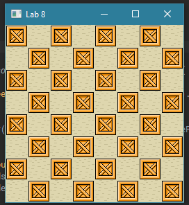

# Lab 8: GUI Programming
This lab8 will cover the following topics:
* JavaFX Canvas, Scenes, VBox

## JavaFX background
JavaFX is a GUI framework which uses a theatre metaphor to represent the application. A single stage can have different scenes, which themselves consist of panes holding nodes.  

Typically, a JavaFX program is structured as follows:
1. Define a class extending the `Application` class
2. Override the abstract `start` method inherited from `Application`
3. In the start method:
    * Prepare a scene graph
    * Construct a scene, with the root node of the scene graph
    * Set up the stage with the constructed scene
4. Define a main method to launch the application

In this lab8, we will have a VBox as the root node, containing a single Canvas node. This itself is part of the checkerboardScene, which is passed to the primaryStage in the start function.

### Canvas
You will use the `Canvas` class extensively in this lab8 and in PA2. For your reference, the documentation is provided [here](https://docs.oracle.com/javafx/2/canvas/jfxpub-canvas.htm). You may find the following functions useful:
* getGraphicsContext2D
* setHeight/setWidth
* drawImage

### load images
There are several ways to load img file to Image, you can check this documents:[Image API](https://docs.oracle.com/javase/10/docs/api/javafx/scene/image/Image.html)

```java
try {
    image = new Image(Main.class.getResource("/package/img.png").toURI().toString());
    } catch (URISyntaxException e) {
    e.printStackTrace();
    }
```
or 
```java
image = new Image("file:src/package/img.png");
```
Be carefull of the relative path. `Main.class.getResource("/package/img.png")` uses `src` as root dir while if using `file:src/package/img.png`, image will be searched in classpath.


## What you need to do
Load the two image files, and generate a checkerboard pattern based on the two images. E.g. for an 8x8 checkerboard scene, the following output should be generated:  
  

There is no need to handle invalid (non-positive) inputs, but you can expect situations where the number of rows do not match the number of columns. In the following lab8, we will make this interactively resizable. This is in preparation for an important component of PA2: the level editor. The detailed TODO information is provided in the Javadoc comments. Complete the TODOs and run the code to verify output.

## Submisson to CASS
1. Zip the project, and submit it to CASS
2. Two screenshots, one for 8x8 checkerboard, one for 10*16 checkerboard. Put the screenshots in one single PDF and submit it to CASS

## Tips
* To load image, you need to check the [Image API](https://docs.oracle.com/javase/10/docs/api/javafx/scene/image/Image.html)
* You may need to get the graphics context object of the canvas to draw images
* The logic for determining which image to draw can be determined succinctly in a one-liner, can you figure it out?