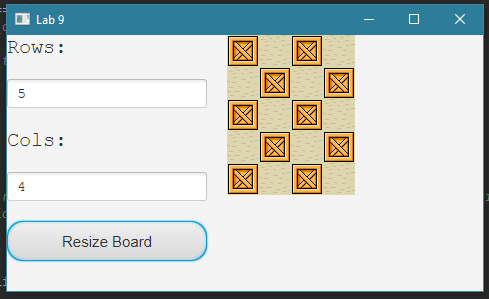

# Lab 9: Event Driven Programming
This lab will cover the following topics:
* JavaFX Canvas, Scenes, VBox
* JavaFX Buttons, Inputs, Callbacks
* JavaFX Styling

## Event driven programming
In event-driven programming, code is executed upon activation of events such as user actions (e.g. key presses and mouse clicks). To do this, we create a handler class, and call it when the event is triggered. There are three ways of defining an event handler:

### 1. Using a regular class
```
public class ControlCircle extends Application {
  ...
  public void start (Stage primaryStage) { 
    ...
    btEnlarge.setOnAction(
      new EnlargeHandler());
    }
}

class EnlargeHandler implements EventHandler<ActionEvent> {
  public void handle(ActionEvent e) {
    circlePane.enlarge(); 
  }
}
```

### 2. Anonymous inner classes
```
public class ControlCircle extends Application {
  ...
  public void start (Stage primaryStage) {
    btEnlarge.setOnAction(new EventHandler<ActionEvent>() {
      public void handle(ActionEvent e) {
        circlePane.enlarge();
      }
    });
  }
}
```

### 3. Lambda expressions
```
public class ControlCircle extends Application {
  ...
  public void start (Stage primaryStage) {
    btEnlarge.setOnAction( e -> {
      circlePane.enlarge();
    });
  }
}
```

The third is preferred because it requires less typing and is easier to read.

## Get the input text in a TextField
You may use `Textield.getCharacters()` to read the input text in a TextField
```$xslt
TextField rowInput = new TextField();
String input = rowInput.getCharacters().toString();
```

## JavaFX layout
In this lab, we will construct the scene as follows:
* Scene
    * Hbox
        * VBox inputsContainer
            * Label rowText
            * TextField rowInput
            * Label colText
            * TextField colInput
            * Button resizeButton
        * Canvas canvas
        
As well, the logic for rendering the canvas has been refactored into its own method. You will not only need to call this function in the original scene construction function, but also inside the callback for the button.

## Callback for the resize button
When clicking this button, the event should trigger a dynamic redraw of the canvas based on the (assumed to be valid) inputs inside the two textfields. You may need to use `setOnMouseClicked`, which takes an EventHandler. You are suggested to use [lambda expressions](http://code.makery.ch/blog/javafx-8-event-handling-examples/). We will go into lambdas in more detail in future labs.

## CSS
A CSS file has been provided for you, but feel free to modify it however you see fit. In PA2, you will have the freedom to change the CSS as well.

## What you need to do
This lab builds upon what you completed for Lab 8. We will add two fields and a button which interactively resizes the checkerboard based on what values the user submits. Again, there is no need to handle invalid (non-positive) inputs, but you can expect situations where the number of rows do not match the number of columns.  

This is in preparation for an important component of PA2: the level editor. The detailed TODO information is provided in the Javadoc comments. Complete the TODOs and run the code to verify output.  
  

## Lab Outcome & Submission
* Submit your implemented project 
* Submit 3 screenshots of your program with different size specified in the TextFields:
    * 5*5
    * 10*6
    * 16*9

