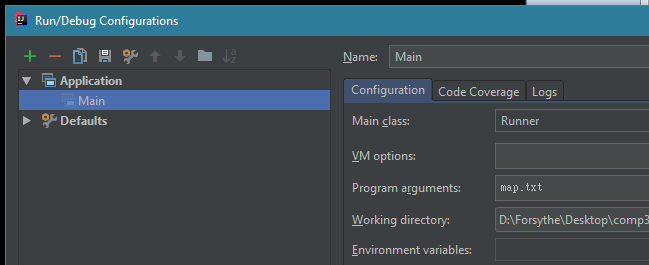

# COMP3021 PA1: Sokoban ASCII Game
## Background
Sokoban (倉庫番) is a type of transport puzzle, in which the player pushes boxes or crates around in a warehouse, trying to get them to storage locations. We will be making a text based version of the game.  


## ASCII representation
In our version, there is a slight modification. Crates will be given unique lowercase letter IDs, and the destination tiles will be given uppercase IDs. The lowercase and uppercase letter IDs must match in order to win the game. Note that the letters are not necessarily unique. 

For example, in the below map, there are two crates `a`s and one crate `b`. The uppercase letters are their corresponding destinations. The player is represented using `@`. Note that when parsing a map text file, the first integer is the number of rows, and the second is the number of columns.

```
5
10
##########
#..a@...A#
#b...a...#
#B.....A.#
##########
```

Exceptions should be thrown when the map is determined to be invalid during parsing.

## Loading the input
You should pass in the name of the map as an argument to your program. In Intellij, this is done in `run > edit configurations > program arguments`  


## Win or deadlock conditions
The game is won when all the crates have been pushed onto their corresponding destinations. If deadlock is detected, then the game terminates automatically. We detect deadlock when it is impossible to push the crates anymore, but the win condition has not been reached. Note that there are additional deadlock conditions where the crates can still move but the game is unwinnable; for simplicity's sake, we don't check for these conditions.

### Example of deadlock  
```
##########
#a@.....A#
#........#
#b.....Aa#
##########
Game deadlocked. Terminating...
```

## Controls
`w` Move up  
`a` Move left  
`s` Move down  
`d` Move right  
`r` Reload the map, resetting any potential progress  
In each iteration, the game prompts the user for a letter, and makes the corresponding move.

## The Optional Class
We use the Optional class extensively to handle map elements. The Optional class is a generic container object which may or may not contain a null value. In our situation, we use the Optional class to represent the fact that our tiles may or may not be occupied with a crate or tile. The API is given [here](https://docs.oracle.com/javase/8/docs/api/java/util/Optional.html).

## Completed demo
A working PA1_obfuscated.jar has been provided for you to test out. To run the demo, put the map file (e.g. `map.txt`) inside the folder `PA1 Obfuscated`, then open command line, `cd` into the folder `PA1 Obfuscated`, and call `java -jar PA1_obfuscated.jar map.txt` in the command line.

## What you need to do
Your job is to complete the TODOs in the project. A detailed description of each task is provided in the javadoc comment above each function. In Intellij, go to `view > tool windows > todo` to jump to each in the code. Make sure you import the project, don't just open it directly. A video showing how to import the project into Intellij is given [here](https://youtu.be/58xRIW5D-Zo).

| TODO                                     | Practiced Concepts                                    |
|------------------------------------------|-------------------------------------------------------|
| DestTile::isCompleted                    | Inheritance, polymorphism, class             |
| DestTile::getRepresentation              | Class, overriding                            |
| Tile::getOccupant                        | Class, overriding                            |
| Tile::getRepresentation                  | Class, overriding                            |
| Map::initialize                          | Exception handling, polymorphism                      |
| Map::movePlayer                          | Class, inheritance, polymorphism, interfaces |
| Map::moveCrate                           | Class, inheritance, polymorphism, interfaces |
| Map::isOccupiableAndNotOccupiedWithCrate | Class, inheritance, polymorphism, interfaces |
| Game::loadMap                            | File IO, exception handling                           |
| Game::isWin                              | Basic Java (an elegant alternative: lambda)                      |
| Game::isDeadLocked                       | Basic Java                                                    |
| Game::display                            | Basic Java                                                    |
| Game::makeMove                           | Baisc Java                                                    |

## Practiced concepts and description of each method in TODO tasks
### DestTile.java 
* isCompleted
    * Inheritance, polymorphism, class
    * First check if the current DestTile is has an occupant, and whether the occupant is a Crate. If so, check if lowercase ID of the Crate matches the uppercase ID of the DestTile.
    
* getRepresentation
    * Class, overriding
    * If the DestTile has an occupant, return the occupant's representation. Otherwise, return the DestTile's own ID.
    
### Tile.java 
* getOccupant 
    * Class, overriding
    * Return the occupant wrapped with an Optional ofNullable object.
    
* getRepresentation 
    * Class, overriding
    * If the Tile has an occupant, return the occupant's representation. Otherwise, return the `.` char.
    
### Map.java 
* initialize 
    * Exception handling, polymorphism
    * Instantiate the member variables of the Map class. Then, iterate over the provided 2d char array, and populate the 2d Cell array member variable with the correct Tile, DestTile, and any of their potential occupants (Crate or Player). Throw exceptions when an unknown char is encountered, or the total number of players is not 1.
    
* movePlayer 
    * Class, inheritance, polymorphism, interfaces
    * Move the player (and any potentially pushed crates) to a new spot given the direction. Conditions to check for:
        * Is the new spot valid?
        * Is the new spot occupiable? (i.e. is it a Tile or DestTile, not a Wall)
        * Is the new spot occupied with a crate? If so, are we able to push it in the direction we moved? (i.e. there's no obstruction behind the crate)
    
* moveCrate 
    * Class, inheritance, polymorphism, interfaces
    * Move the crate if the destination is occupiable but not occupied with a crate
    
* isOccupiableAndNotOccupiedWithCrate 
    * Class, inheritance, polymorphism, interfaces
    * Conditions to check for:
        * Is the new spot valid?
        * Is the location Occupiable, and the occupant is not a Crate, or there's no occupant
    
### Game.java 
* loadMap 
    * File IO, exception handling
    * Read the file, and instantiate and initialize the map member variable. Throw exception if necessary.
    
* isWin 
    * Basic Java (an elegant alternative: lambda)
    * Check if all DestTiles are completed
    
* isDeadlocked 
    * Basic Java
    * For each crate, check if they can at least move up/down or left/right. 
        * For a crate to be able to move vertically, there must be empty spaces both above and below it: one space is for the player to stand, the other is for the crate to move to.
        * Similarly for left/right moves
        * If none of the crates have (empty spots above/below OR empty spots left/right), then the game is deadlocked

* display 
    * Basic Java
    * Print out the map to console
    
* makeMove 
    * Basic Java
    * Call Map::movePlayer based on the char, or re-initialize the map if necessary. Return whether the action was made.

## Others
* We provide JavaDoc for your reference.
* we provide some tests for your code. To run the tests, you need add JUnit5.2 into your classpath. You should write more test cases by yourself to check your implementation. To run JUnit tests, you may refer to following [video](https://youtu.be/58xRIW5D-Zo?t=25s) in lab 1 (starting from 25s), to import JUnit5.2 into classpath and then execute the test.
You may also refer to the [official doc](https://www.jetbrains.com/help/idea/configuring-testing-libraries.html) from IntelliJ (Section: Add a test library to the classpath when writing the code for a test):


## Sample gameplay
```
Loading map: map2.txt
5
10
##########
#@...a..A#
#b..a....#
#B.....A.#
##########
Enter a valid move [wasdr]: d
##########
#.@..a..A#
#b..a....#
#B.....A.#
##########
Enter a valid move [wasdr]: d
##########
#..@.a..A#
#b..a....#
#B.....A.#
##########
Enter a valid move [wasdr]: d
##########
#...@a..A#
#b..a....#
#B.....A.#
##########
Enter a valid move [wasdr]: d
##########
#....@a.A#
#b..a....#
#B.....A.#
##########
Enter a valid move [wasdr]: d
##########
#.....@aA#
#b..a....#
#B.....A.#
##########
Enter a valid move [wasdr]: d
##########
#......@a#
#b..a....#
#B.....A.#
##########
Enter a valid move [wasdr]: a
##########
#.....@.a#
#b..a....#
#B.....A.#
##########
Enter a valid move [wasdr]: a
##########
#....@..a#
#b..a....#
#B.....A.#
##########
Enter a valid move [wasdr]: a
##########
#...@...a#
#b..a....#
#B.....A.#
##########
Enter a valid move [wasdr]: s
##########
#.......a#
#b..@....#
#B..a..A.#
##########
Enter a valid move [wasdr]: s
##########
#.......a#
#b..@....#
#B..a..A.#
##########
Enter a valid move [wasdr]: a
##########
#.......a#
#b.@.....#
#B..a..A.#
##########
Enter a valid move [wasdr]: s
##########
#.......a#
#b.......#
#B.@a..A.#
##########
Enter a valid move [wasdr]: d
##########
#.......a#
#b.......#
#B..@a.A.#
##########
Enter a valid move [wasdr]: d
##########
#.......a#
#b.......#
#B...@aA.#
##########
Enter a valid move [wasdr]: d
##########
#.......a#
#b.......#
#B....@a.#
##########
Enter a valid move [wasdr]: a
##########
#.......a#
#b.......#
#B...@.a.#
##########
Enter a valid move [wasdr]: a
##########
#.......a#
#b.......#
#B..@..a.#
##########
Enter a valid move [wasdr]: a
##########
#.......a#
#b.......#
#B.@...a.#
##########
Enter a valid move [wasdr]: a
##########
#.......a#
#b.......#
#B@....a.#
##########
Enter a valid move [wasdr]: w
##########
#.......a#
#b@......#
#B.....a.#
##########
Enter a valid move [wasdr]: w
##########
#.@.....a#
#b.......#
#B.....a.#
##########
Enter a valid move [wasdr]: a
##########
#@......a#
#b.......#
#B.....a.#
##########
Enter a valid move [wasdr]: s
##########
#.......a#
#@.......#
#b.....a.#
##########
You win!

Process finished with exit code 0
```
